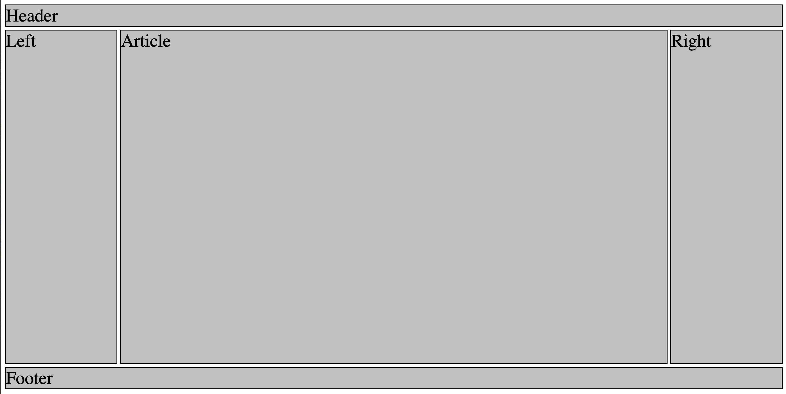

# holy-grail-layout
## The "holy grail" of webpage layout templates 
 
This code demonstrates the "holy grail" of website layout templates. It has a header, footer, main article column, and left and right aside columns, and is done in CSS Grid Layout. This template structure is seen throughout the web, and it can adapted to virtually any website design that utilizes this form of layout.
